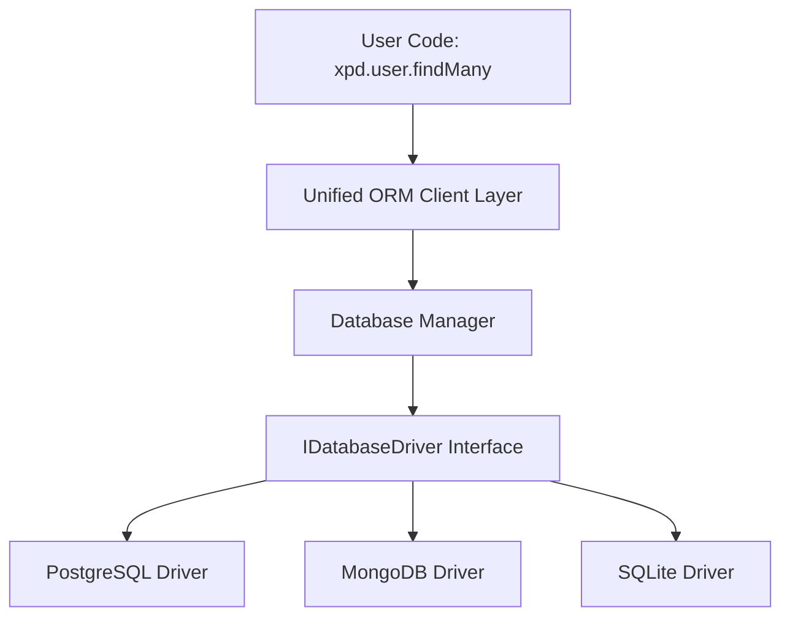
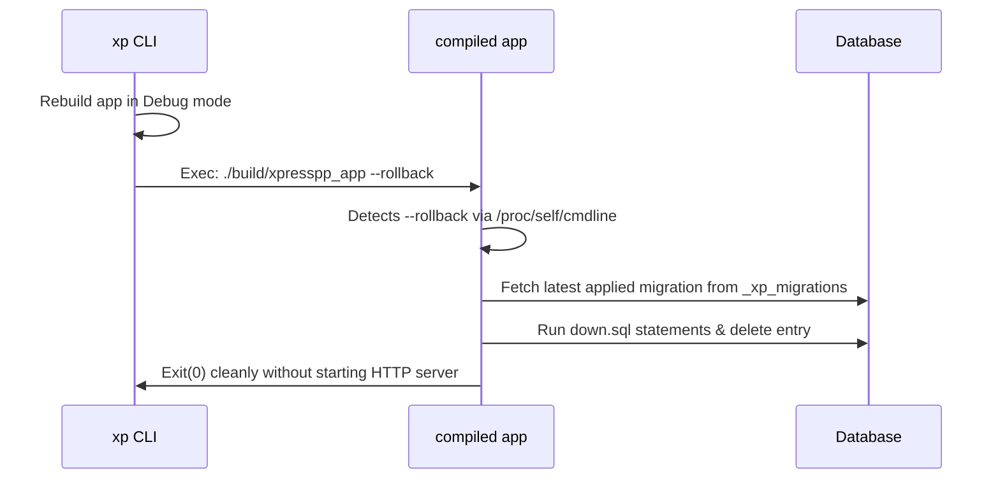

# Native Database Driver Architecture & Migration Engine in Xpress++

This document outlines the architecture, design patterns, and implementation of the **Unified Database Driver Engine**, **Migration Engine**, and **CLI Rollback Mechanism** in Xpress++.

---

## 🏛️ 1. Core Architecture

The database layer of Xpress++ is fully decoupled from Drogon's high-level ORM and structured into three layers to support relational (PostgreSQL, SQLite) and document (MongoDB) databases natively with zero performance overhead.



### Key Design Pillars
1. **Unified Driver Contract (`IDatabaseDriver`):** All queries and CRUD tasks are delegated to driver instances connected through `DatabaseManager`.
2. **Unified Client (`XpdClient`):** Replaces the previous `PrismaClient` to present `xpd` as the framework-native database client variable (e.g. `xpd.user.create(...)`).
3. **Prepared Statement Security:** SQL queries are fully parameterized to protect against SQL injections, mapping parameters to typed `std::variant<...>` variants.
4. **C++20 Coroutine Compliant I/O:** Every CRUD action uses non-blocking coroutines, enabling high-performance non-blocking query handling for edge AI and web devices.

---

## ⚙️ 2. Migration and Rollback Engine

Xpress++ implements a lightweight, fully automated migration runner tracking applied migrations in a schema table named `_xp_migrations`.

### A. Automatic Migration Execution
On startup, `SchemaSync::syncAll()` initiates a migration scan:
1. Creates the `_xp_migrations` tracking table if not present.
2. Scans the local `./migrations/` folder, sorting directories alphabetically.
3. Compares directory names (timestamps) against the database tracking table.
4. Executes the `up.sql` of any pending migrations inside a split-statement executor, then records them in `_xp_migrations`.

### B. Safe Coroutine Exception Handling
Under the C++20 standard, `co_await` statements are strictly prohibited inside exception `catch` blocks. To ensure safe rollback if a migration script fails, Xpress++:
1. Captures exceptions and sets a failure flag in the `try` block.
2. Moves the `down.sql` rollback sequence outside the `catch` block.
3. Safely executes the rollback queries before rethrowing the exception to halt app startup.

```cpp
bool failed = false;
std::string error_msg;
try {
    // Run up.sql statements...
} catch (const std::exception& e) {
    failed = true;
    error_msg = e.what();
}

if (failed) {
    // Run down.sql rollback sequence safely using co_await...
    throw std::runtime_error(error_msg);
}
```

---

## 🔄 3. Transparent CLI Rollback (`xp migrate rollback`)

To maintain a zero-dependency CLI binary, `xp` doesn't link to database libraries. Instead, the CLI delegates database operations to the user's compiled app with specific command-line parameters.



### Startup Interceptor
Inside the `App` class and `listen()` entrypoints, the application intercepts the process execution before configuring ports:
- **Command-line & Environment Check:** Scans `/proc/self/cmdline` for `--rollback` / `-r` and checks the `XP_ROLLBACK` environment variable.
- **Silent Rollback Execution:** If present, calls `rollbackLastMigration()`. Rather than setting up HTTP server ports or showing the console splash banner, it runs the Drogon loop directly to run the coroutine database tasks, then calls `std::exit(0)` to exit cleanly.

---

## 🚀 4. How to Use

1. **Write Schema:** Define your models in `schema.xp`.
2. **Generate Client & Migrations:** Run `xp migrate` (or `xp migrate dev --name <name>`).
3. **Application DB Queries:** Access tables using the global `xpd` client instance:
   ```cpp
   auto user = co_await xpd.user.findUnique({{"where", {{"username", "aaryan"}}}});
   ```
4. **Rollback Migrations:** If a database change needs to be undone, run:
   ```bash
   xp migrate rollback
   ```
